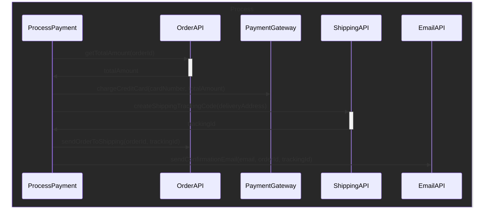
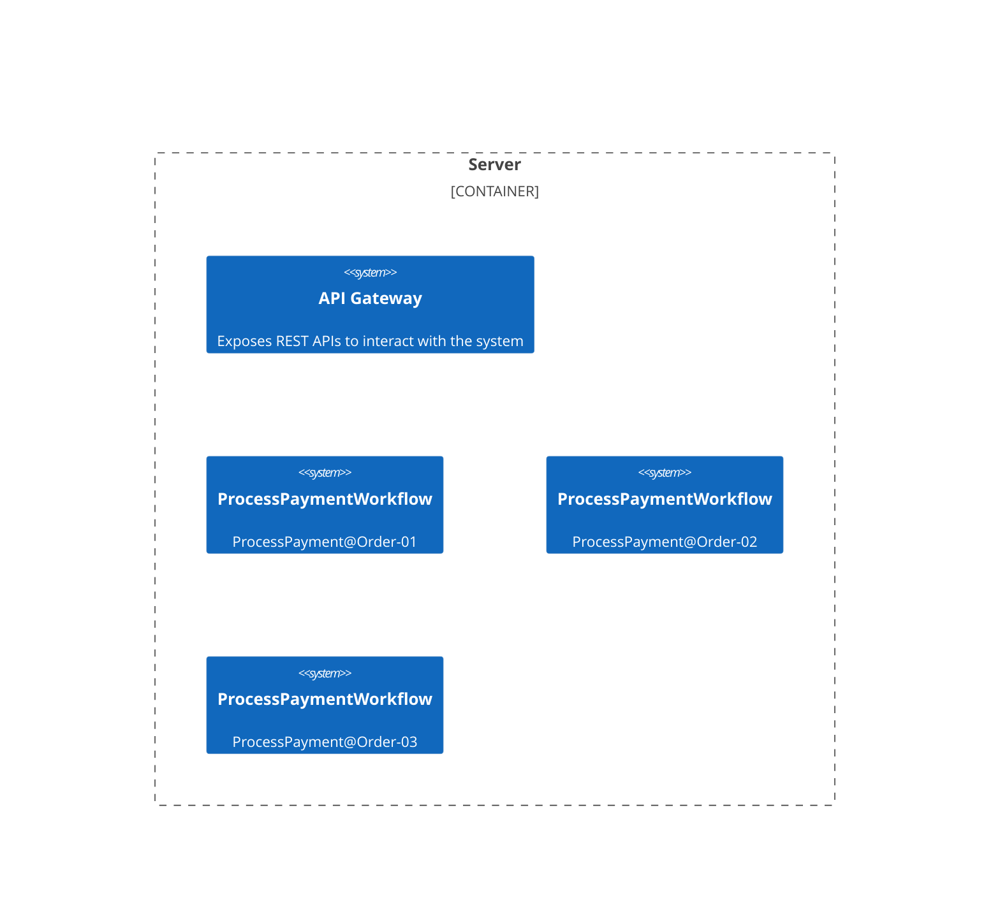
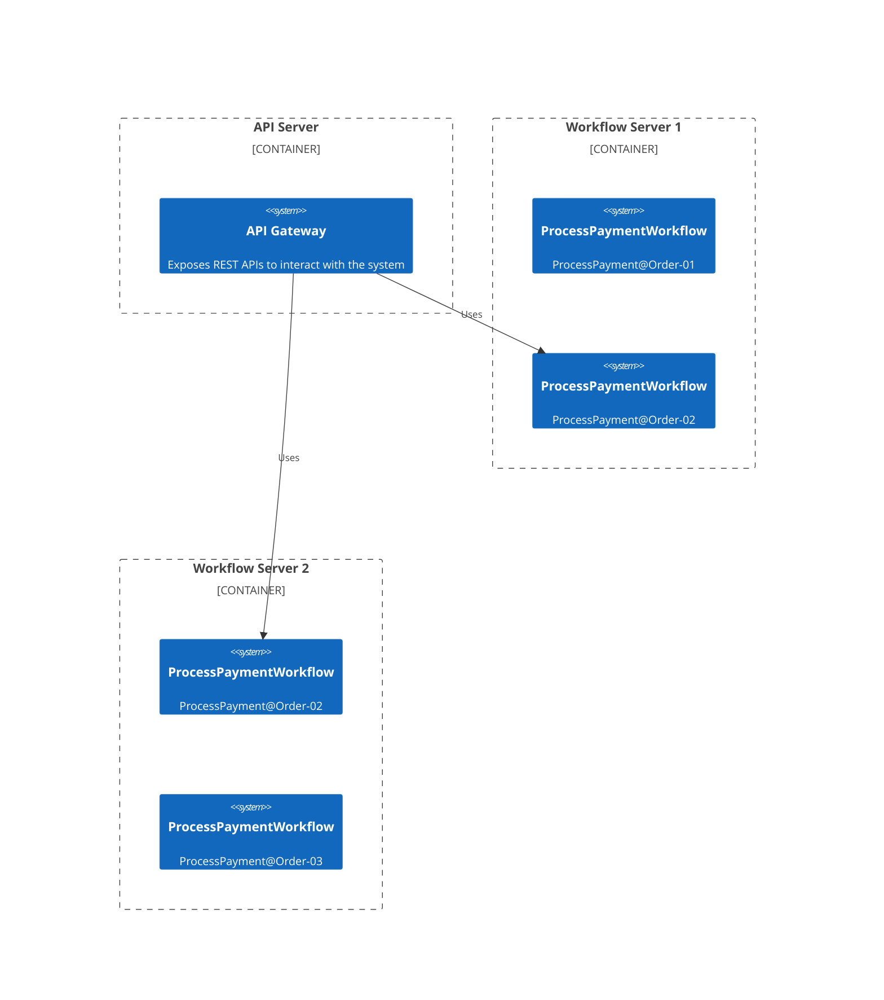

```mermaid
sequenceDiagram
participant ProcessPayment
participant OrderAPI 
participant PaymentGateway
participant ShippingAPI
participant EmailAPI
rect rgb(40,90,40)
ProcessPayment->>+OrderAPI: getTotalAmount(orderId)
OrderAPI->>-ProcessPayment: totalAmount
end
rect rgb(60,90,60)
ProcessPayment->>PaymentGateway: chargeCreditCard(cardNumber, totalAmount)
end
rect rgb(40,40,40)
ProcessPayment->>+ShippingAPI: createShippingTrackingCode(deliveryAddress)
ShippingAPI->>-ProcessPayment: trackingId
end
rect rgb(60,60,60)
ProcessPayment->>OrderAPI: sendOrderToShipping(orderId, trackingId)
end
rect rgb(40,40,40) 
ProcessPayment->>EmailAPI: sendConfirmationEmail(email, orderId, trackingId)
end
```

## Durable Workflows 
### with Effect Cluster

---
layout: fact
---

# THANK YOU ORGANIZERS!


---
layout: image-left
image: /image-me.jpg
---

# Ego Slide
<br/>

- Push buttons
- Type things
- Break stuff
- Wear sweatshirt as cape
- This picture is not stack safe

---
layout: image
image: /wf-example.png
---

<!--
We've all had to deal with a computation like this at least once in your lifetime.
And I am sure that even today in some point of your application you indeed have one like this in production.
Sure, the domain of your problem may change a little, maybe its not processing a payment, but let's take this as today's example.

Let's see what happens step by step.

We first get back from the order the total amount that is due to the products in the order.
Once we've done that, we process the payment through our payment gateway.
And finally, we create a trackingId for the shipping, tell the warehouse that the order can be shipped, and send a confirmation email to the user that also contains the tracking id.

There is a lot going on in here.
But can you spot the problem we have in our code?

The real problem here is that we have a complex workflow that may branch in different ways we need to manage.
And there may be some failures along the way.
Sure the happy path is pretty clear, but what happens if something fails?
-->

---

## Failures along the way
<br/>

```ts{all}

function chargeCreditCard(cardNumber, totalAmount): Effect<void, InsufficientFundsError | PaymentGateway503Error>
function createShippingTrackingCode(deliveryAddress): Effect<TrackingId, NoMoreApiCallQuotaError>
function sendConfirmationEmail(email, orderId, trackingId): Effect<void, SmtpFailureError>

const processPayment: Effect<
    void, 
    InsufficientFundsError | PaymentGateway503Error | NoMoreApiCallQuotaError | SmtpFailureError
  > = ...
```
<!--

Effect is a tool that is of great help with this, and as long correctly define each building block, the effect datatype let the possible errors pass through so we can handle them.

We have domain errors, network errors, temporary errors, everything.

But what do we do with those errors? How should we handle them? Just letting the list growing is not an option.
-->

---

## Log on failure
<br/>

```ts{all}
const processPayment = 
  (cardNumber: CardNumber, deliveryAddress: DeliveryAddress, 
  email: EmailAddress, orderId: OrderId) =>
    Effect.gen(function*($) {
      const totalAmount = yield* $(getTotalAmount(orderId))
      yield* $(chargeCreditCard(cardNumber, totalAmount))
      const trackingId = yield* $(createShippingTrackingCode(deliveryAddress))
      // ^- failure raised here!
      yield* $(sendOrderToShipping(orderId, trackingId)) // skipped
      yield* $(sendConfirmationEmail(email, orderId, trackingId)) // skipped
    })

```
<!--
Ok, let's say we start very simple, and we just bounce back the error to the user into some fancy UI.

What happens if the workflows succefully registers the order, process the payment and then fail to create the tracking id due to the hourly quota being exausted? 
The user will indeed see a fancy error page saying "Oops, you exausted your API quota", but what will happen to the just received order? Will it be processed anyway? Will it be clear to the purchasing user that he does not need to do anything because the order has been received anyway?

Most of the errors we have here will take care of themselves just with time right? So why not just try again?
This way we potentially get out of our error list all of those errors that are temporary.
-->

---

## Retrying everything
<br/>

```ts{all}
const processPayment = 
  (cardNumber: CardNumber, deliveryAddress: DeliveryAddress, 
  email: EmailAddress, orderId: OrderId) =>
    Effect.gen(function*($) {
      const totalAmount = yield* $(getTotalAmount(orderId))
      yield* $(chargeCreditCard(cardNumber, totalAmount))
      const trackingId = yield* $(createShippingTrackingCode(deliveryAddress))
      // ^- failure raised here!
      yield* $(sendOrderToShipping(orderId, trackingId)) // skipped
      yield* $(sendConfirmationEmail(email, orderId, trackingId)) // skipped
    }).pipe(
      Effect.retry({
        while: error => isTemporaryError(error)
      })
    )
```
<!--

Sure, effect is great because inside its computation primitive retries are already a built in concept, so maybe what we can do upon an error is simply attempt to perform again the entire workflow right?
We can simply toss in a retry policy over the entire workflow and that's it.

But it has its problems. Back to our example, let's say that on the first run we succefully get the amount to pay, we process the payment, and again we fail to create the tracking id.

What do we expect to happen when we retry again the whole workflow?

Will the credit card be charged again for the same order? This does not seem right.
We cannot just retry everything and call it a day.
In any business process when we have an error we need to handle it or retry it in some meaningful way, providing just the error or retrying everything is not enough.
-->
---

## Business Process
<br/>



<!--

All business process end up looking exactly the one I described before, even more complicated than that, and no matter how you write your code, using different methods or a single long procedural code, or using whatever library you want, they all end up having the same problem.
They have to perform everything and work inside the request, because it's all in process. There are various steps and all need to be handled if this fails, I need to ensure to do that, and all of that has to work and be executed in process, or even in-request.

So what happens if due to retries on temporary onavailable system the business process is taking hours or even days to complete?
What happens to our business process if for some reason we have to restart or kill our server due to an update?

Our local retries won't help here, as the process will be completely restarted from the first step upon server restart leaving everything in a dirty state.

-->

---

## Transactions?
<br/>

```sql{all}
BEGIN TRANSACTION;
UPDATE card_balances SET balance = balance - 10 WHERE card_number = 42
UPDATE orders SET tracking_id = 'abc' WHERE order_id = 12
COMMIT TRANSACTION;
```
<!--
Some people may say that this problem is really trivial, and what you need to do is just put some transactions around, so you ensure that upon missing commit all the changes made to the system before will be rolled back.

So BEGIN and COMMIT you can ensure that will either happen or completely fail, right?

The problem is that there is no magic begin commit and rollback function for external services.

When interacting with different systems, like for example REST APIs, emails, etc..., ACID transactions are not an available option.

External systems receive writes, and are not partecipant of the transaction.
-->
---
layout: fact
---

## Distributed systems are everywhere

<!--
And it may seem strange, but this is not tied to having actual external system hosted on other servers you try to call.
Let's say that you have a database with a product catalog, and in a database you store the sku, the name of the product and the name of an image for the catalog.
The actual image is stored into the filesystem.

Trying to perform a delete of all the products in the catalog is a distributed workflow.
It involves two different systems, the database and the filesystem.
And you need to ensure that you either delete both the record on the database and the image, or you keep both of them.
-->

---
layout: fact
---

## Distributed Workflows are everywhere

---
layout: fact
---

## Welcome Effect Cluster
All the building blocks you need to deal with distributed workflows with ease!

<!--
So dealing with distributed systems can be quite a pain.
And that's why we started building Effect Cluster, a library that helps you by providing all the basic building blocks you need in order to create and orchestrate your distributed workflows.
-->

---
layout: image-left
image: /image-saga.png
---

## ...long lived transactions?
<br/>

- Sagas!
- in 1987 they had computers!


<!--
One of the concept that helped shaping up Durable Workflows in Effect Cluster is the concept of a Saga.

The concept of Saga cames from a really old paper and back in the days it tried to solve a really similar yet different problem.

Basically they had this heavy computations that would hold onto a database transaction for a really long time, until finished, and this prevented any other smaller transaction to be performed, making the system completely unresponsive.

And as we are now, they were looking for a way to have a guaranteed that the system will eventually complete the execution of all of the steps, or revert completely as it never happened in the same way a single acid transaction would behaved, without using a long database transaction.
-->

---



<!--

```mermaid
sequenceDiagram
participant ProcessPayment
participant OrderTable 
participant PaymentsTable
participant ShippingTable
participant NotificationsTable
rect rgb(40,40,40)
ProcessPayment->>+OrderTable: Transaction 1
end
rect rgb(60,60,60)
ProcessPayment->>PaymentsTable: Transaction 2
end
rect rgb(40,40,40)
ProcessPayment->>+ShippingTable: Transaction 3
end
rect rgb(60,60,60)
ProcessPayment->>OrderTable: Transaction 4
end
rect rgb(40,40,40) 
ProcessPayment->>NotificationsTable: Transaction 5
end
```

The idea is, instead of having a big long transaction that spans the entire flow, you could actually break it up into many smaller transaction, and perform them one after the other, and they are hold on together by some kind of messaging or signaling.

-->

---



<!--

```mermaid
sequenceDiagram
participant ProcessPayment
participant OrderAPI 
participant PaymentGateway
participant ShippingAPI
participant EmailAPI
rect rgb(40,40,40)
ProcessPayment->>+OrderAPI: getTotalAmount(orderId)
OrderAPI->>-ProcessPayment: totalAmount
end
rect rgb(60,60,60)
ProcessPayment->>PaymentGateway: chargeCreditCard(cardNumber, totalAmount)
end
rect rgb(40,40,40)
ProcessPayment->>+ShippingAPI: createShippingTrackingCode(deliveryAddress)
ShippingAPI->>-ProcessPayment: trackingId
end
rect rgb(60,60,60)
ProcessPayment->>OrderAPI: sendOrderToShipping(orderId, trackingId)
end
rect rgb(40,40,40) 
ProcessPayment->>EmailAPI: sendConfirmationEmail(email, orderId, trackingId)
end
```

And even if we don't have actual database transactions, the same applies here for our use case!
Each external system invocation can be indeed considered a transaction.
-->
---


<!--
There is also some kind of persistence involved that record in a durable log the interactions of the workflow and its single steps.

Thanks to this durable log, if the execution is retried after a server restart or a regular retry, the workflow can skip altogether the already performed steps, and resume the pending execution were it left, avoiding useless execution of external services.
-->

---
layout: two-cols
---

## Defining an activity
<br/>

- Work unit of a Workflow
- Can interact with external systems
- Executes an Effect
- Uniquely identified inside Workflow
- Requires schemas for success and failure

::right::

```ts{all|3|4|5-6|8-17}
const getTotalAmount = (id: string) =>
Activity.make(
    `get-amount-due-${id}`, // identifier
    Schema.number, // success schema
    Schema.struct({ code: Schema.number, 
      message: Schema.string }) // error schema
  )(
    pipe(
      Http.request.get(`/get-total-amount/${id}`)
      Http.client.fetchOk(),
      Effect.andThen((response) => response.json),
      Effect.mapError(() => ({ 
        code: 500, 
        message: `API Fetch error`
        })
      )
    )
  )
```

<!--
The first basic building block we want to define is an Activity.
Activities can do anything, you can perform things on a database, you can make http calls, whatever you want.

An activity is identified with a string that needs to be unique inside the execution of your workflow. 
In order to know how to persist the execution result, an activity takes in both the schema of the failure and the success type it can results into. Only string defects are supported at the moment.
Finally you have to provide the effect to be run as body of the activity.
-->


---
layout: two-cols
---

## Defining a workflow
<br/>

- Is started by a Request
- Requires schemas for success and failure
- Has a payload of information

::right::

```ts
class ProcessPaymentRequest extends 
  Schema.TaggedRequest<ProcessPaymentRequest>()(
  `ProcessPaymentRequest`, // tag
  Schema.never, // failure
  Schema.boolean, // success
  {
    orderId: Schema.string,
    cardNumber: Schema.string,
    email: Schema.string,
    deliveryAddress: Schema.string
  }
) {
}
```
<!--
Before defining a workflow, we need to define a Request that is used to start the workflow.
The request should have a schema for both the error and the success case, in order to allow persistence of the execution result of the workflow.
The request object itself can also have additional information that is used by the workflow to kick off the execution, they are indeed the arguments you can pass in to your workflow function.
-->
---
layout: two-cols-header
---


## Defining a workflow

```ts{all}
const processPaymentWorkflow = Workflow.make(
  ProcessPaymentRequest,
  (_) => `ProcessPayment@${_.orderId}`,
  ({ cardNumber, deliveryAddress, email, orderId }) =>
    Effect.gen(function*($) {
      const totalAmount = yield* $(getTotalAmount(orderId))
      yield* $(chargeCreditCard(cardNumber, totalAmount))
      const trackingId = yield* $(createShippingTrackingCode(deliveryAddress))
      yield* $(sendOrderToShipping(orderId, trackingId))
      yield* $(sendConfirmationEmail(email, orderId, trackingId))
    })
)
```
<br/>
::left::

- Coordinator of activities
- Durable execution
- Requires deterministic code

::right::


<!--
And here we have instead how we define a workflow.

As you can see you need to pass in the RequestType this workflow can handle.
The second argument is a function that given the request will create a globally unique string that identifies this workflow instance, and this string identifier can be used both internally and externally to reference this instance of the workflow.
The last argument is the body of the workflow that is an effect that inside itself will call some activities.

As we said before, a workflow is a coordinator of multiple activities that has guaranteed durable execution, and therefore have some contrains.
In order to allow workflows to be executed for days across potential server restarts, they need to be coded in a way the only perform deterministic work.

-->
---
layout: two-cols-header
---
## WTF is deterministic?

Given a set of input, the output of the function must be always the same and predictable, without triggering any side effects that may later affect the computation.

::left::
#### Deterministic

- Math & Logic ops
- Seed based random

::right::
#### Non-Deterministic

- Math.random()
- new Date()
- R/W Global Shared State (also DB)

<!--

What does it means to be deterministic? 
It basically means that whatever the state of the system you are into, the output should be always the same and predictable.
Accessing time, reading from the filesystem or a database, and making an http call is not deterministic by default, as they completely depend on the state of the system or the execution.
-->
---

## Determinism & Workflows

```ts{all}
const processPaymentWorkflow = Workflow.make(
  ProcessPaymentRequest,
  (_) => "ProcessPayment@" + _.orderId,
  ({ cardNumber, deliveryAddress, email, orderId }) =>
    Effect.gen(function*($) {
      const totalAmount = yield* $(Effect.succeed(42.1) /* getTotalAmount(orderId) */) 
      yield* $(Effect.unit /* chargeCreditCard(cardNumber, totalAmount) */)
      const trackingId = yield* $(createShippingTrackingCode(deliveryAddress))
      yield* $(sendOrderToShipping(orderId, trackingId))
      yield* $(sendConfirmationEmail(email, orderId, trackingId))
    })
)
```
<!--

The determinism is what allows workflows to be durable. 
Upon server restarts, your workflow code will be executed again.
Any activity that has been succefully run to completion in previous execution will be replaced by the stored result.
Thanks to the workflow code being deterministic, we can guarantee that by replaying the execution we'll reach the same state we were in before the server stopped. 

Does that mean that you cannot perform non-deterministic work? No, it just needs to be wrapped inside an activity.
-->
---

## Running a Workflow

```ts{all}
const main = Effect.gen(function*($) {
  const workflows = Workflow.union(processPaymentWorkflow, requestRefundWorkflow)
  const engine = yield* $(WorkflowEngine.makeScoped(workflows)) 
  yield* $(
    engine.sendDiscard(
      new ProcessPaymentRequest({
        orderId: "order-1",
        cardNumber: "my-card",
        deliveryAddress: "My address, 5, Italy",
        email: "my@email.com"
      })
    )
  )
})
runMain(
  pipe(
    main,
    Effect.provide(DurableExecutionJournalPostgres.DurableExecutionJournalPostgres)
  )
)
```

<!--
Ok, now we created a workflow. How do we run it?
We need to spawn up a WorkflowEngine.
The WorkflowEngine is the working unit that is responsible of starting new workflow instances and keep track of all the workflows instances being executed.
You can either start a new execution of a workflow without caring for the result by using the sendDiscard method, or start it and wait for the result to came back using send.

In order to create a WorkflowEngine you need to provide a durable storage that will be used by the activities to store the attempts of execution and the successful results.
-->
---
layout: fact
---

# Activity is a Black Box

<!--
We said before that determinism is very important, and it's the determinism that allows workflows to be written such as some kind of failures or timeouts does not exists and they are retied indefinetely.

Code with side effects, must be run inside an activity, and that is because when replaying the workflow, the engine will use the rusult of previous run of the activities instead of running them again. 

But unfortunately the WorkflowEngine does not have any inside about what our activity is doing.
Once the workflow engine starts the activity, it becames a black box for it until the result comes back.
-->

---
layout: two-cols
---


## The double-payment problem
<br/>

- Any transport may fail
- Not getting a response does not mean it has not been processed

::right::



<!--

```mermaid { scale: 0.55 }
sequenceDiagram
box rgb(50,50,50)
participant Workflow
end
box rgb(40,40,40)
participant PaymentRestAPI
participant BalanceDatabase
end
rect rgb(40,60,40)
Workflow->>+PaymentRestAPI: HTTP Request (1st attempt)
PaymentRestAPI->>+BalanceDatabase: Begin Processing
BalanceDatabase->>-PaymentRestAPI: Payment Performed
end
rect rgb(60,40,40)
PaymentRestAPI->>-Workflow: HTTP Response
end
rect rgb(40,60,40)
Workflow->>+PaymentRestAPI: HTTP Request (2nd attempt)
PaymentRestAPI->>+BalanceDatabase: Begin Processing
BalanceDatabase->>-PaymentRestAPI: Payment Performed
PaymentRestAPI->>-Workflow: HTTP Response
end
```

Let's say for example that your workflow calls an HTTP payment api.
You trigger the HTTP request from your server, the request arrives on the payment rest api, and the execution of the request starts.
The execution completes on the payment processor, but just before receiving the HTTP response, the connection is unstable and it never arrives.

On the workflow side the activity never received a response, so it never completed.
Seen by the workflow side the issue is a network issue, and its the same as the request was never received by the payment rest api.
That means that eventually the workflow will attempt to execute again the activity, thinking that it never succeeded before.

So we just learned that while workflows are required to be deterministic, activities are required to be idempotent.
-->

---
layout: fact
---
## Idempotency

Multiple invocation of the same function, result on a state change as they were executed only the first time.

<!--
What does exactly idempotent mean?

Idempotent means that multiple invocation of an effect should result in state changes only upon the first invocation, subsequent one should not change the state of the system.

Let's say that we have a database with a orders table, and the primary key is an autoincrement.
Is performing an insert idempotent? No, because calling multiple times the query will result in multiple duplicated record in the same database.

Is performing a delete by primary key idempotent? Yes but no, yes because trying to delete an already deleted record will not result into any system change, but I need to say no because some other user may have inserted another record again in the database while we performed the delete the second time.
-->
---
layout: two-cols
---

## Idempotence using IDs
<br/>

```ts {all}
const chargeCreditCard = 
 (cardNumber: string, amountDue: number) =>
  pipe(
    Activity.persistenceId,
    Effect.flatMap(
      (persistenceId) => callPaymentGateway(
        persistenceId, 
        cardNumber, 
        amountDue
      )
    ),
    Activity.make(
      "charge-credit-card",
      Schema.void, 
      Schema.never
    )
  )

```

::right::



<!--

```mermaid { scale: 0.55 }
sequenceDiagram
box rgb(50,50,50)
participant Workflow
end
box rgb(40,40,40)
participant PaymentRestAPI
participant BalanceDatabase
end
rect rgb(40,60,40)
Workflow->>+PaymentRestAPI: HTTP Request (1st attempt)
PaymentRestAPI->>+BalanceDatabase: Begin Processing
BalanceDatabase->>-PaymentRestAPI: Payment Performed 
end
rect rgb(60,40,40)
PaymentRestAPI->>-Workflow: HTTP Response
end
rect rgb(40,60,40)
Workflow->>+PaymentRestAPI: HTTP Request (2nd attempt)
PaymentRestAPI->>+BalanceDatabase: Request Payment
BalanceDatabase->>BalanceDatabase: Skip as already processed
BalanceDatabase->>-PaymentRestAPI: Payment Performed
PaymentRestAPI->>-Workflow: HTTP Response
end
```

A common practice to avoid that is using unique keys for each request, usually known as idempotence key.
Using an idempotence key, the remote service is able to detect duplicated requests, and avoid processing the same request twice.

And Effect Cluster already provides you a deterministic execution id that can be used as idempotence key for your activities.
There is also a method to access the current attempt number, in order to know if this is the first time that you are trying to execute your activity.
-->
---
layout: image
image: /image-wf-update.gif
---

<!--
We said before that usually workflows have activities that are eventually retried until they either succeed or timeout with a failure.
But what happens if an activity is failing due to a bug in our code and is being retried forever? Are we doomed to fail it forever?

Thanks to the activity definition being idempotent, we can update of the activity definition without any worries.
We can stop the workflow engine, update the activity definition, and then spin up the workflow engine again and see that now our workflow will eventually complete.
-->
---

## Yielding workflow execution
<br/>

```ts{12-15}
const getTotalAmount = (id: string) =>
  pipe(
    Http.request.get(`/get-total-amount/${id}`)
    .pipe(
      Http.client.fetchOk(),
      Effect.andThen((response) => response.json),
      Effect.retry(
        Schedule.exponential(1000).pipe(
          Schedule.compose(Schedule.recurs(32)),
        ),
      ),
      Effect.catchAllCause(() => pipe(
        Effect.logError("Something is wrong with the OrderAPI right now"),
        Effect.zipRight(Workflow.yieldExecution)
      ))
    ),
    Activity.make(`get-amount-due-${id}`, Schema.number, Schema.never)
  )
```
<!--
In order to catch such scenarios, you can also use Workflow.yieldExecution to effectfully pause the execution of the workflow.
This can be really useful if you want to avoid forever-retries when you detect unexpected scenarios.
Here for example we write out the error in the observability log, and pause the execution.
The developer can receive a notification in such cases, and apply the needed fixes or system checks.

What about fixing workflow code instead?
That is a little more trickier, but not so much.
-->
---


## Fixing workflows
<br/>

```ts{all}
const processPaymentWorkflow = Workflow.make(
  ProcessPaymentRequest,
  (_) => `ProcessPayment@${_.orderId}`,
  ({ cardNumber, deliveryAddress, email, orderId }) =>
    Effect.gen(function*($) {
      const version = yield* $(getCurrentVersion(2))
      // ^- for already running WFs, will resolve with previous value (1)
      // ...
      if(version >= 2){
        yield* $(checkTrustedCardNumber(cardNumber))
      }
      yield* $(chargeCreditCard(cardNumber, totalAmount))
      // ...
    })
)

const getCurrentVersion = (definitionVersion: number) => pipe(
  Effect.succeed(definitionVersion),
  Activity.make("get-current-version", Schema.number, Schema.void)
)
```
<!--

As we said before, workflow definition code must be deterministic.
This means that we can fix running workflows, as long we don't break too much the determinism.
We can for example use an activity to store the version for the workflow when started, and use conditional logic based on that.
-->
---
layout: fact
---

## All or Nothing

<!--
As we said before when speaking about the Saga paper, we said that we want the guarantee that either we perform all step successfully, or we abort everything as it never happened.
Up to now we spoke about using workflows to retry indefinitely some activities until they succeed.
But what to do if we have a failure downstream?

What do we do if for example after we charged the credit card we found out we are out of stock and there is no way to have more stock?
This is a common case when you have for example airplane tickets, and the amount of seats is limited.
-->

---

## Compensating actions
<br/>

```ts{all}
const processPaymentWorkflow = Workflow.make(
  ProcessPaymentRequest,
  (_) => `ProcessPayment@${_.orderId}`,
  ({ cardNumber, deliveryAddress, email, orderId }) =>
    pipe(
      getTotalAmount(orderId),
      Effect.flatMap(totalAmount => pipe(
        chargeCreditCard(cardNumber, totalAmount),
        Effect.flatMap(() => createShippingTrackingCode(deliveryAddress)),
        Effect.tap(trackingId => sendOrderToShipping(orderId, trackingId)),
        Effect.tap(trackingId => sendConfirmationEmail(email, orderId, trackingId)),
        Effect.catchTag("OutOfStockError", () => refundCreditCard(cardNumber, totalAmount))
      ))
    )
)
```

<!--
Cluster workflow supports all the effect semantics in a durable manner.
That means you can use APIs like catchTag to recover in case of error, and process a refund if the airplane is fully booked.
The refundCreditCard is an activity as well, that means that can be retried forever.

This way our workflow has granted a all or nothing semantic by using "compensating activities" that revert the changes performed by an activity.
The refundCreditCard is the compensating action for chargeCreditCard.
-->

---
layout: fact
---

## Effect Cluster Workflows
Building durable and reliable Effects for your applications

<!--
We've seen how effect cluster allowed us to write durable and resilient workflows by using regular effect code.
To some extends the workflow code we've seen is can be seen as just regular effects.
-->

---
layout: image
image: /wf-server.png
---

<!--
We also listed a lot of use cases where we may need a distributed workflow, so maybe a single server instance running both all of our workflows and our APIs is not the best.

If for some reason the single server instance has network problems or is struggling to perform its work that could be a problem.
So maybe we can spin up multiple servers to run our workflows?
-->

---
layout: image
image: /wf-cluster.png
---

<!--
Yeah, that may work, but opens up to some problems.
How do we ensure that the workflow instance processing a payment is not performed on two different servers at the same time?

Sure, you can use a global lock to ensure that only once is executed, but is it the best way?
Using a global lock would result in a central point of failure, that will also reduce the throughtput of your system.

But what are the alternatives?
-->

---
layout: image
image: /tables-single.png
transition: fade
---

<!--
Let's see the same problem in a real world scenario.

Let's imagine we have a restaurant with 30 tables for two people and a single waiter.
The waiter will take the orders for all the tables, but that will take a lot of time for him to process all of the tables by himself.

The restaurant owner decides to introduce a new waiter to help the first one take all the orders.
But how does the restaurant ensures that all tables will have their order taken and no order will be taken twice?
-->

---
layout: image
image: /tables-double.png
transition: fade
---

<!--
We can simply decide upfront that the tables from 1 to 3 will be processed by the first waiter, and the others from the second waiter.
When a couple seats at one table, there is no need for one waiter to ask the other if the order has already been taken.
Everyone knows upfront the sets of tables they are in charge, and we can decide assignments for whatever number of tables and waiters we have.
-->


---
layout: image
image: /tables-died.png
transition: fade
---

<!--
If for some reason one of the workers dies, the restaurant owner assigns again the tables to the living waiters so we ensure that every table is assigned to a waiter.
Then if somehow the worker comes to live again, the restaurant owner assign back some tables to the worker.
-->

---
layout: image
image: /tables-resurrected.png
transition: fade
---

<!--
If for some reason one of the workers dies, the restaurant owner assigns again the tables to the living waiters so we ensure that every table is assigned to a waiter.
Then if somehow the worker comes to live again, the restaurant owner assign back some tables to the worker.
-->

---
layout: fact
---

## Effect Cluster Sharding and Location Transparency
Safely distribute work and refer to entity without knowing their location

<!--
The pattern we've just seen is called sharding, and Effect Cluster also includes a sharding and location transparency set of utilities in order to build a cluster of server that share workloads of entities to process.
-->

---
layout: image
image: /sharding-balancing.gif
---

<!--
Cluster Sharding is all about building entities that live across different processes and communicate with each other by just knowing the entity ID.
In order to do so, there is a shard manager that behaves in the same way the restaurant owner did, assigning ranges of entities IDs to each cluster partecipant. Each time a new partecipant appears or disappears, the assignments are rebalanced across all remaining members.
-->

---

```ts
import * as RecipientType from "@effect/cluster/RecipientType"
import * as Schema from "@effect/schema/Schema"

export class Increment extends Schema.TaggedClass<Increment>()("Increment", {
  messageId: Schema.string
}) {}

export class Decrement extends Schema.TaggedClass<Decrement>()("Decrement", {
  messageId: Schema.string
}) {}

export class GetCurrent extends 
  Schema.TaggedRequest<GetCurrent>()("GetCurrent", Schema.never, Schema.number, {
  messageId: Schema.string
}) {}

export const CounterMsg = Schema.union(Increment, Decrement, GetCurrent)
export type CounterMsg = Schema.Schema.To<typeof CounterMsg>

export const CounterEntity = RecipientType.makeEntityType("Counter", CounterMsg, (_) => _.messageId)
```

<!--
Sharding is not tied to just executing workflows.
That means you are also free to define your own messages using Effect Schema in the same way we defined before the request to start a workflow.
-->

---

```ts
Sharding.registerEntity(
  CounterEntity
)(
  RecipientBehaviour.fromFunctionEffectStateful(
    () => Effect.succeed(0),
    (_, message, stateRef) => {
      switch (message._tag) {
        case "Increment":
          return pipe(Ref.update(stateRef, (count) => count + 1), Effect.as(MessageState.Processed(Option.none())))
        case "Decrement":
          return pipe(Ref.update(stateRef, (count) => count - 1), Effect.as(MessageState.Processed(Option.none())))
        case "GetCurrent":
          return pipe(
            Ref.get(stateRef),
            Effect.exit,
            Effect.map((result) => MessageState.Processed(Option.some(result)))
          )
      }
    }
  )
)
```

<!--
Once we defined the message protocol, we can define a behaviour that recives the messages and perform any logic you want based on the message.
It can start the execution of a single instance of a workflow as we have seen before, or it can be any arbitrary logic you want.
-->

---
layout: two-cols-header
---
## Today's Recap
<br/>

Effect cluster provides all the basic building blocks you'll need to build distributed workflows and systems

::left::
`@effect/cluster`
- Sharding
- Shard Manager
- Messaging utilities

`@effect/cluster-node`
- Cluster specific utilities for NodeJS

::right::

`@effect/cluster-workflow`
- Activity
- Workflow
- WorkflowEngine

`@effect/cluster-pg`
- Postgres based persistency for Workflow and Sharding

---
layout: fact
---

## Happy Effect-ing!
Thanks for your time!


---

# .

---


<!--

```mermaid
sequenceDiagram
box rgb(40,40,40) Workflow
participant Workflow
participant Service1 
participant Service2
participant Service3
participant Service4
end
rect rgb(60,60,60)
Workflow->>+Service1: Activity 1
end
rect rgb(60,60,60)
Workflow->>Service2: Activity 2
end
rect rgb(60,60,60)
Workflow->>+Service3: Activity 3
end
rect rgb(60,60,60)
Workflow->>Service1: Activity 3
end
rect rgb(60,60,60) 
Workflow->>Service4: Activity 4
end
```

Let's start by putting on some naming convention.

From now on we'll call Activity the single step.
A workflow is then just the logic glue that ties together a sequence of activities.
-->

---

## Everyday Code
<br/>

```ts{all}
const processPayment = 
  (cardNumber: CardNumber, deliveryAddress: DeliveryAddress, 
  email: EmailAddress, orderId: OrderId) =>
    Effect.gen(function*($) {
      // get total order amount
      const totalAmount = yield* $(getTotalAmount(orderId))
      // charge the credit card
      yield* $(chargeCreditCard(cardNumber, totalAmount))
      // create a tracking id
      const trackingId = yield* $(createShippingTrackingCode(deliveryAddress))
      // send the order to shipment
      yield* $(sendOrderToShipping(orderId, trackingId))
      // send a confirmation email
      yield* $(sendConfirmationEmail(email, orderId, trackingId))
    })
```

<!--
We've all had to deal with a computation like this at least once in your lifetime.
And I am sure that even today in some point of your application you indeed have one like this in production.
Sure, the domain of your problem may change a little, maybe its not processing a payment, but let's take this as today's example.

Let's see what happens step by step.

We first get back from the order the total amount that is due to the products in the order.
Once we've done that, we process the payment through our payment gateway.
And finally, we create a trackingId for the shipping, tell the warehouse that the order can be shipped, and send a confirmation email to the user that also contains the tracking id.

There is a lot going on in here.
But can you spot the problem we have in our code?

The real problem here is that we have a complex workflow that may branch in different ways we need to manage.
And there may be some failures along the way.
Sure the happy path is pretty clear, but what happens if something fails?
-->


---

## Scaling the system
<br/>



<!--
We also listed a lot of use cases where we may need a distributed workflow, so maybe a single server instance running both all of our workflows and our APIs is not the best.

If for some reason the single server instance has network problems or is struggling to perform its work that could be a problem.
So maybe we can spin up multiple servers to run our workflows?
-->

---

### Ensuring only one execution of each workflow instance
<br/>



<!--
Yeah, that may work, but opens up to some problems.
How do we ensure that the workflow instance processing a payment is not performed on two different servers at the same time?

Sure, you can use a global lock to ensure that only once is executed, but is it the best way?
Using a global lock would result in a central point of failure, that will also reduce the throughtput of your system.

But what are the alternatives?
-->