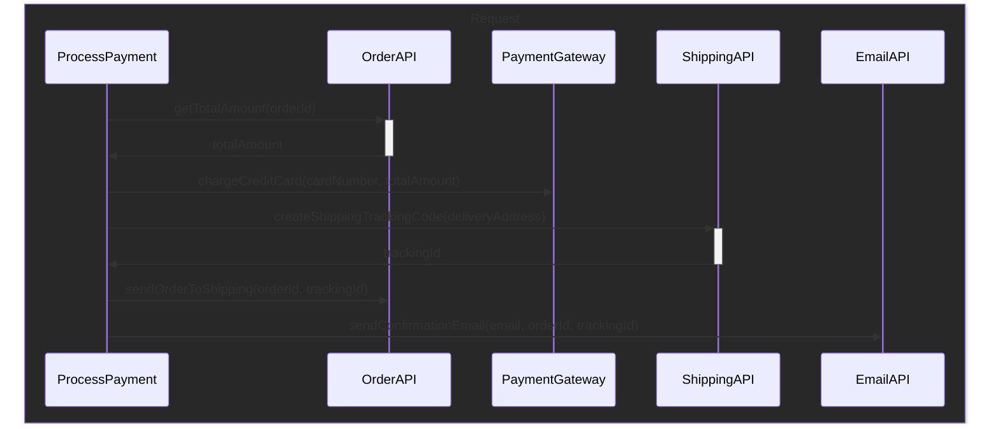

```mermaid
sequenceDiagram
participant ProcessPayment
participant OrderAPI 
participant PaymentGateway
participant ShippingAPI
participant EmailAPI
rect rgb(40,40,40)
ProcessPayment->>+OrderAPI: getTotalAmount(orderId)
OrderAPI->>-ProcessPayment: totalAmount
end
rect rgb(60,60,60)
ProcessPayment->>PaymentGateway: chargeCreditCard(cardNumber, totalAmount)
end
rect rgb(40,40,40)
ProcessPayment->>+ShippingAPI: createShippingTrackingCode(deliveryAddress)
ShippingAPI->>-ProcessPayment: trackingId
end
rect rgb(60,60,60)
ProcessPayment->>OrderAPI: sendOrderToShipping(orderId, trackingId)
end
rect rgb(40,40,40) 
ProcessPayment->>EmailAPI: sendConfirmationEmail(email, orderId, trackingId)
end
```

---
layout: fact
---

# THANK YOU ORGANIZERS!


---
layout: image-left
image: /image-me.jpg
---

# Ego Slide
<br/>

- Push buttons
- Type things
- Break stuff
- Wear sweatshirt as cape
- This picture is not stack safe

---

## Everyday Code
<br/>

```ts{all}
const processPayment = 
  (cardNumber: CardNumber, deliveryAddress: DeliveryAddress, 
  email: EmailAddress, orderId: OrderId) =>
    Effect.gen(function*(_) {
      // get total order amount
      const totalAmount = yield* _(getTotalAmount(orderId))
      // charge the credit card
      yield* _(chargeCreditCard(cardNumber, totalAmount))
      // create a tracking id
      const trackingId = yield* _(createShippingTrackingCode(deliveryAddress))
      // send the order to shipment
      yield* _(sendOrderToShipping(orderId, trackingId))
      // send a confirmation email
      yield* _(sendConfirmationEmail(email, orderId, trackingId))
    })
```

<!--
We've all had to deal with a computation like this at least once in your lifetime.
And I am sure that even today in some point of your application you indeed have one like this in production.
Sure, the domain of your problem may change a little, maybe its not processing a payment, but let's take this as today's example.


We first get back from the order the total amount that is due to the products in the order.
Once we've done that, we process the payment through our payment gateway.
And finally, we create a trackingId for the shipping, tell the warehouse that the order can be shipped, and send a confirmation email to the user that also contains the tracking id.

There is a lot going on in here.
But can you spot the problem we have in our code?

The real problem here is that we have a complex workflow that may branch in different ways we need to manage.
And there may be some failures along the way.
Sure the happy path is pretty clear, but what happens if something fails?
-->

---

## Failures along the way
<br/>

```ts{all}

function chargeCreditCard(cardNumber, totalAmount): Effect<void, InsufficientFundsError | PaymentGateway503Error>
function createShippingTrackingCode(deliveryAddress): Effect<TrackingId, NoMoreApiCallQuotaError>
function sendConfirmationEmail(email, orderId, trackingId): Effect<void, SmtpFailureError>

const processPayment: Effect<
    void, 
    InsufficientFundsError | PaymentGateway503Error | NoMoreApiCallQuotaError | SmtpFailureError
  > = ...
```
<!--

Effect is a tool that is of great help with this, and as long correctly define each building block, the effect datatype let the possible errors pass through so we can handle them.

But what do we do with those errors? How should we handle them? Just letting the list growing is not an option.
-->

---

## Log on failure
<br/>

```ts{all}
const processPayment = 
  (cardNumber: CardNumber, deliveryAddress: DeliveryAddress, 
  email: EmailAddress, orderId: OrderId) =>
    Effect.gen(function*(_) {
      const totalAmount = yield* _(getTotalAmount(orderId))
      yield* _(chargeCreditCard(cardNumber, totalAmount))
      const trackingId = yield* _(createShippingTrackingCode(deliveryAddress))
      // ^- failure raised here!
      yield* _(sendOrderToShipping(orderId, trackingId)) // skipped
      yield* _(sendConfirmationEmail(email, orderId, trackingId)) // skipped
    })
```
<!--
Ok, let's say we start very simple, and we just bounce back the error to the user into some fancy UI.

What happens if the workflows succefully registers the order, process the payment and then fail to create the tracking id due to the hourly quota being exausted? 
The user will indeed see a fancy error page saying "Oops, you exausted your API quota", but what will happen to the just received order? Will it be processed anyway? Will it be clear to the purchasing user that he does not need to do anything because the order has been received anyway?
-->

---

## Retrying everything
<br/>

```ts{all}
const processPayment = 
  (cardNumber: CardNumber, deliveryAddress: DeliveryAddress, 
  email: EmailAddress, orderId: OrderId) =>
    Effect.gen(function*(_) {
      const totalAmount = yield* _(getTotalAmount(orderId))
      yield* _(chargeCreditCard(cardNumber, totalAmount))
      const trackingId = yield* _(createShippingTrackingCode(deliveryAddress))
      // ^- failure raised here!
      yield* _(sendOrderToShipping(orderId, trackingId)) // skipped
      yield* _(sendConfirmationEmail(email, orderId, trackingId)) // skipped
    }).pipe(
      Effect.retry({
        while: error => isTemporaryError(error)
      })
    )
```
<!--
Most of the errors we have here will take care of themselves just with time right? So why not just try again?
This way we potentially get out of our error list all of those errors that are temporary.

Sure, effect is great because inside its computation primitive retries are already a built in concept, so maybe what we can do upon an error is simply attempt to perform again the entire workflow right?
We can simply toss in a retry policy over the entire workflow and that's it.

But it has its problems. Back to our example, let's say that on the first run we succefully get the amount to pay, we process the payment, and again we fail to create the tracking id.

What do we expect to happen when we retry again the whole workflow?

Will the credit card be charged again for the same order? This does not seem right.
We cannot just retry everything and call it a day.
In any business process when we have an error we need to handle it or retry it in some meaningful way, providing just the error or retrying everything is not enough.
-->
---

## Business Process
<br/>



<!--

All business process end up looking exactly the one I described before, even more complicated than that, and no matter how you write your code, using different methods or a single long procedural code, or using whatever library you want, they all end up having the same problem.
They have to perform everything and work inside the request, because it's all in process. There are various steps and all need to be handled if this fails, I need to ensure to do that, and all of that has to work and be executed in process, or even in-request.

So what happens if due to retries on temporary onavailable system the business process is taking hours or even days to complete?
What happens to our business process if for some reason we have to restart or kill our server due to an update?
Our local retries won't help here, as the process will be completely restarted from the first step upon server restart.

-->

---

## Transactions?
<br/>

```sql{all}
BEGIN TRANSACTION;
UPDATE card_balances SET balance = balance - 10 WHERE card_number = 42
UPDATE orders SET tracking_id = 'abc' WHERE order_id = 12
COMMIT TRANSACTION;
```
<!--
Some people may say that this problem is really trivial, and what you need to do is just put some transactions around, so you ensure that upon missing commit all the changes made to the system before will be rolled back.

So BEGIN and COMMIT you can ensure that will either happen or completely fail, right?

The problem is that there is no magic begin commit and rollback function for external services.

When interacting with different systems, like for example REST APIs, emails, etc..., ACID transactions are not an available option.

External systems receive writes, and are not partecipant of the transaction.
-->

---
layout: fact
---

## Welcome Effect Cluster
All the building blocks you need to deal with distributed workflows with ease!

<!--
As we've just seen building workflow that deal with external systems can be quite a pain.
And that's why we started building Effect Cluster, a library that helps you by providing all the basic building blocks you need in order to create and orchestrate your distributed workflows.
-->

---
layout: image-left
image: /image-saga.png
---

## ...long lived transactions?
<br/>

- Sagas!
- in 1987 they had computers!


<!--
One of the concept that helped shaping up Effect Cluster is the concept of a Saga.

The concept of Saga cames from a really old paper and back in the days it tried to solve a really similar yet different problem problem.

Basically they had this heavy computations that would hold onto a database transaction for a really long time, until finished, and this prevented any other smaller transaction to be performed, making the system completely unresponsive.

And as we are now, they were looking for a way that even across server restarts, the system will eventually complete the execution of all of the steps, or revert completely as it never happened in the same way a single acid transaction would behaved.
-->

---



<!--

The idea is, instead of having a big long process that spans the entire flow of multiple steps that could involve external systems as we have seen before, you could actually break it up into many smaller steps, and perform them one after the other, and they are hold on together by some kind of messaging or signaling.

Some kind of persistence will record the interactions between the ProcessPayment and the external systems, by storing in a durable record the attempts to call the external systems and the eventual result they returned.

-->
---


<!--

```mermaid
sequenceDiagram
participant ProcessPayment
participant OrderAPI 
participant PaymentGateway
participant ShippingAPI
participant EmailAPI
rect rgb(40,90,40)
ProcessPayment->>+OrderAPI: getTotalAmount(orderId)
OrderAPI->>-ProcessPayment: totalAmount
end
rect rgb(60,90,60)
ProcessPayment->>PaymentGateway: chargeCreditCard(cardNumber, totalAmount)
end
rect rgb(40,40,40)
ProcessPayment->>+ShippingAPI: createShippingTrackingCode(deliveryAddress)
ShippingAPI->>-ProcessPayment: trackingId
end
rect rgb(60,60,60)
ProcessPayment->>OrderAPI: sendOrderToShipping(orderId, trackingId)
end
rect rgb(40,40,40) 
ProcessPayment->>EmailAPI: sendConfirmationEmail(email, orderId, trackingId)
end
```

Thanks to this durable log, if the execution is retried after a server restart or a regular retry, the ProcessPayment workflow can skip altogether the already performed steps, and resume the pending execution were it left, avoiding useless execution of external services.
-->
---


<!--

```mermaid
sequenceDiagram
box rgb(40,40,40) Workflow
participant Workflow
participant Service1 
participant Service2
participant Service3
participant Service4
end
rect rgb(60,60,60)
Workflow->>+Service1: Activity 1
end
rect rgb(60,60,60)
Workflow->>Service2: Activity 2
end
rect rgb(60,60,60)
Workflow->>+Service3: Activity 3
end
rect rgb(60,60,60)
Workflow->>Service1: Activity 3
end
rect rgb(60,60,60) 
Workflow->>Service4: Activity 4
end
```

Let's start by putting on some naming convention.

From now on we'll call Activity the interaction from the workflow to the external services.
A workflow is then just the logic glue that ties together a sequence of activities.
-->
---
layout: two-cols
---

## Defining an activity
<br/>

- Work unit of a Workflow
- Can interact with external systems
- Executes an Effect
- Uniquely identified inside Workflow
- Requires schemas for success and failure
- Will be retried upon restarts

::right::

```ts{all|14|15|16}
const getTotalAmount = (id: string) =>
  pipe(
    Http.request.get(`/get-total-amount/${id}`)
    .pipe(
      Http.client.fetchOk(),
      Effect.andThen((response) => response.json),
      Effect.mapError(() => ({ 
        code: 500, 
        message: "API Fetch error" 
        })
      )
    ),
    Activity.make(
      "get-amount-due", // identifier
      Schema.number, // success schema
      Schema.struct({ code: Schema.number, message: Schema.string })
    )
  )
```

<!--
The first basic building block we want to define is an Activity.
What is an activity? An activity is a effect that gets executed inside a workflow.
It can do whatever you want, you can perform things on a database, you can make http calls, whatever you want.

An activity is identified with a string that needs to be unique inside the execution of your workflow. 
In order to know how to persist the execution result, an activity takes in both the schema of the failure and the success type it can results into. Only string defects are supported at the moment.
Finally you have to provide the effect to be run as body of the activity.
That effect will be retried by default, so it needs to be idempotent.
-->


---
layout: two-cols
---

## Defining a workflow
<br/>

- Is started by a Request
- Is identified by a globally unique id
- Requires schemas for success and failure
- Has a payload of information

::right::

```ts
class ProcessPaymentRequest 
  extends Schema.TaggedRequest<ProcessPaymentRequest>()(
  "ProcessPaymentRequest",
  Schema.never, // failure
  Schema.boolean, // success
  {
    orderId: Schema.string,
    cardNumber: Schema.string,
    email: Schema.string,
    deliveryAddress: Schema.string
  }
) {
}
```
<!--
Before defining a workflow, we need to define a Request that is used to start the workflow.
The request should have a schema for both the error and the success case, in order to allow persistence of the execution result of the workflow.
The request object itself can also have additional information that is used by the workflow to kick off the execution, they are indeed the arguments you can pass in to your workflow function.
-->
---
layout: two-cols-header
---


## Defining a workflow

```ts{all}
const processPaymentWorkflow = Workflow.make(
  ProcessPaymentRequest,
  (_) => "ProcessPayment@" + _.orderId,
  ({ cardNumber, deliveryAddress, email, orderId }) =>
    Effect.gen(function*(_) {
      const totalAmount = yield* _(getTotalAmount(orderId))
      yield* _(chargeCreditCard(cardNumber, totalAmount))
      const trackingId = yield* _(createShippingTrackingCode(deliveryAddress))
      yield* _(sendOrderToShipping(orderId, trackingId))
      yield* _(sendConfirmationEmail(email, orderId, trackingId))
    })
)
```
<br/>
::left::

- Coordinator of activities
- Durable execution
- Requires deterministic code

::right::


<!--
And here we have instead how we define a workflow.

As you can see you need to pass in the RequestType this workflow can handle.
The second argument is a function that given the request will create a globally unique string that identifies this workflow instance, and this string identifier can be used both internally and externally to reference this instance of the workflow.
The last argument is the body of the workflow that is an effect that inside itself will call some activities.

As we said before, a workflow is a coordinator of multiple activities that has guaranteed durable execution, and therefore have some contrains.
In order to allow workflows to be executed for days across potential server restarts, they need to be coded in a way the only perform deterministic work.

-->
---
layout: two-cols-header
---
## WTF is deterministic?

Given a set of input, the output of the function must be always the same and predictable, without triggering any side effects that may later affect the computation.

::left::
#### Deterministic

- Math & Logic ops
- Seed based random

::right::
#### Non-Deterministic

- Math.random()
- new Date()
- R/W Global Shared State (also DB)

<!--

What does it means to be deterministic? 
It basically means that whatever the state of the system you are into, the output should be always the same and predictable.
Accessing time, reading from the filesystem or a database, and making an http call is not deterministic by default, as they completely depend on the state of the system or the execution.
-->
---

## Determinism & Workflows

```ts{all}
const processPaymentWorkflow = Workflow.make(
  ProcessPaymentRequest,
  (_) => "ProcessPayment@" + _.orderId,
  ({ cardNumber, deliveryAddress, email, orderId }) =>
    Effect.gen(function*(_) {
      const totalAmount = yield* _(Effect.succeed(42.1) /* getTotalAmount(orderId) */) 
      yield* _(Effect.unit /* chargeCreditCard(cardNumber, totalAmount) */)
      const trackingId = yield* _(createShippingTrackingCode(deliveryAddress))
      yield* _(sendOrderToShipping(orderId, trackingId))
      yield* _(sendConfirmationEmail(email, orderId, trackingId))
    })
)
```
<!--

The determinism is what allows workflows to be durable. 
Upon server restarts, your workflow code will be executed again.
Any activity that has been succefully run to completion in previous execution will be replaced by the stored result.
Thanks to the workflow code being deterministic, we can guarantee that by replaying the execution we'll reach the same state we were in before the server stopped. 

Does that mean that you cannot perform non-deterministic work? No, it just needs to be wrapped inside an activity.
-->
---

## Running a Workflow

```ts{all}
const main = Effect.gen(function*(_) {
  const workflows = Workflow.union(processPaymentWorkflow, requestRefundWorkflow)
  const engine = yield* _(WorkflowEngine.makeScoped(workflows)) 
  yield* _(
    engine.sendDiscard(
      new ProcessPaymentRequest({
        orderId: "order-1",
        cardNumber: "my-card",
        deliveryAddress: "My address, 5, Italy",
        email: "my@email.com"
      })
    )
  )
})
runMain(
  pipe(
    main,
    Effect.provide(DurableExecutionJournalPostgres.DurableExecutionJournalPostgres)
  )
)
```

<!--
Ok, now we created a workflow. How do we run it?
We need to spawn up a WorkflowEngine.
The WorkflowEngine is the working unit that is responsible of starting new workflow instances and keep track of all the workflows instances being executed.
You can either start a new execution of a workflow without caring for the result by using the sendDiscard method, or start it and wait for the result to came back using send.

In order to create a WorkflowEngine you need to provide a durable storage that will be used by the activities to store the attempts of execution and the successful results.
-->
---

## DurableExecutionJournal

<!--

Idempotency:

We said before that determinism is very important, and it's the determinism that allows workflows to be written such as some kind of failures or timeouts does not exists.

Code with side effects, must be run inside an activity, and that is because when replaying the workflow, the engine will use the rusult of previous run of the activities instead of running them again. 

But unfortunately the Workflowengine does not have any inside about what our activity is doing.
Once the workflow engine starts the activity, it becames a black box for it until the result comes back.

That means if that your activity starts the execution, and for some reason the server crashes while performing the activity, upon restart, the activity will be started again by the workflow as it were never started before.

Back to our example, what happens is that if the activity is trying to charge the credit card calling an external http API, but meanwhile the server goes down, upon restart we will charge again the credit card, right?

While workflows are required to be deterministic, activities are instead required to be idempotent.

What does idempotent mean?

Idempotent means that multiple invocation of an effect should result in state changes only upon the first invocation, subsequent one should not change the state of the system.

Let's say that we have a database with a orders table, and the primary key is an autoincrement.

Is performing an insert idempotent? No, because calling multiple times the query will result in multiple duplicated record in the same database.

Is performing a delete by primary key idempotent? Yes but no, yes because trying to delete an already deleted record will not result into any system change, but I need to say no because some other user may have inserted another record again in the database while we performed the delete the second time.

A common practice to avoid that is using unique keys for each request, in order to detect duplicated requests.

Fixing workflows:

We said before that usually workflows have activities that are eventually retried until they either succeed or timeout with a failure.

But what happens if an activity is failing due to a bug in our code? Are we doomed to fail it forever?

Thanks to the activity definition being idempotent, we can do an update of the activity definition without any worries.

We can stop the workflow engine, update the activity definition, and then spin up the workflow engine again.

So for activities is really easy.

What about fixing workflow code instead?

That is a little more trickier, but not so much.

Versioning workflows:

As we said before, workflow definition code must be deterministic.


Activities can be interrupted either if we request to kill the entire workflow, or just to perform a graceful restart of the WorkflowEngine.
In case of a graceful restart of the workflow engine, you can detect that by using WorkflowContext.isGracefulShutdown

We can see that an activity is just a regular Effect, that requires in its env a WorkflowContext.

Yield inside a workflow.
-->

